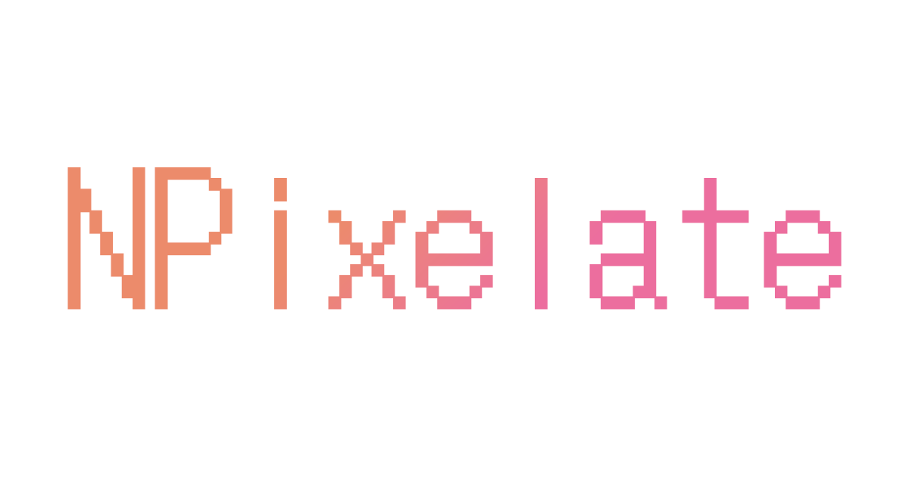
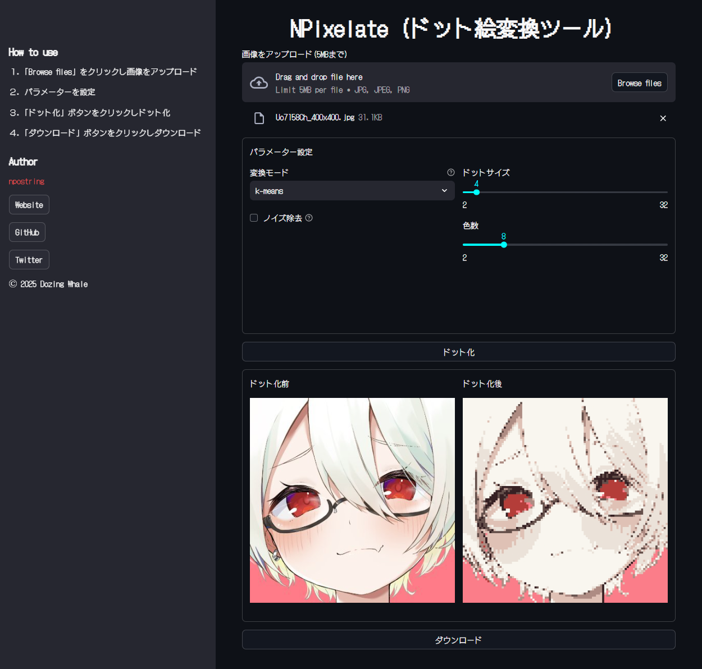

# NPixelate

App for pixelating with various algorithms.
- Web app: https://npixelate.dozingwhale.net/
- Source code: https://github.com/npostring/npixelate

# Installation
Open a terminal and run:
```bash
$ pip install -r requirements.txt
$ streamlit run view.py
```

You can run it from the following URL.
```
http://localhost:8501
```

# Demo

